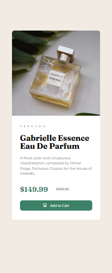

# Frontend Mentor - Product preview card component solution

This is a solution to the [Product preview card component challenge on Frontend Mentor](https://www.frontendmentor.io/challenges/product-preview-card-component-GO7UmttRfa). Frontend Mentor challenges help you improve your coding skills by building realistic projects. 

## Table of contents

- [Overview](#overview)
  - [Screenshot](#screenshot)
- [My process](#my-process)
  - [Built with](#built-with)
  - [What I learned](#what-i-learned)
- [Author](#author)

## Overview
- This is one of the beginner challenges available on the Frontend Mentor website. In this challenge, I attempted the "Product Preview Card Component"

### Screenshot

- This is the Desktop View

- This is the Mobile View

## My process

### Built with

- Semantic HTML5 markup
- CSS custom properties
- Flexbox
- CSS Grid

### What I learned
- I believe my understanding and problem-solving is improving.
- My speed has also improved, having finished this project a lot quicker than previous ones.
- My understanding in the use of grid and flexbox was challenged but I overcame and have improved.

## Author

- Frontend Mentor - [@justcallmeea](https://www.frontendmentor.io/profile/justcallmeea)